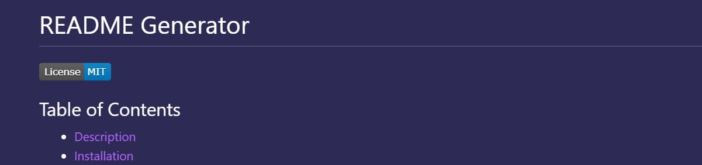

# Rachel's README Generator

## Table of Contents

- [Description](#description)
- [Instructions](#instructions)
- [Github Profile](#github-profile)
- [Link to README Generator](#readme-generator)
- [Contributors](#contributors)

### Description

This README Generator with make a README quick and easy by following these instructions

### Instructions

1. Clone my repo
2. Open your terminal in the file
3. Enter node index.js in the command line
4. Complete the prompted questions and you will then have a fantastic README

### Github Profile

https://github.com/rsolov23

### Link to my README Generator

https://rsolov23.github.io/Rachel-s-Professional-README-Generator/

### Contributors

- Rachel Solov
- Mad props to Google, Stack Overflow, and MDN Web Docs❤️
- Special shout out to Sean, Donte, Andres, Brendan, Megan, Tori, Mike, Bradley, Ask BCS and all my classmates❤️
