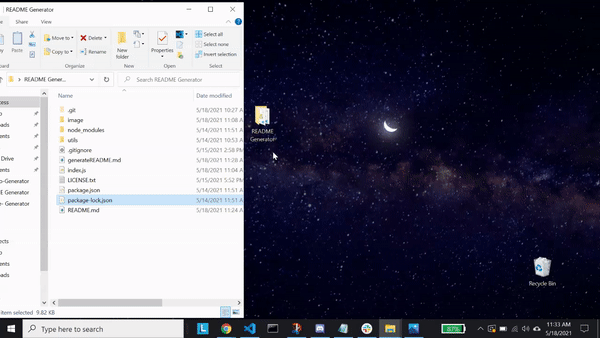
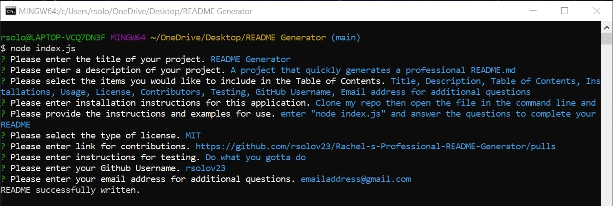

# Rachel's README Generator

## Table of Contents

- [Description](#description)
- [Instructions](#instructions)
- [Usage](#usage)
- [Github Profile](#github-profile)
- [Link to README Generator](#readme-generator)
- [Contribution](#contribution)
- [License](#license)

### Description

This README Generator with make a README quick and easy by following these instructions

### Instructions

1. Clone my repo
2. Open your terminal in the file
3. Enter node index.js in the command line
4. Complete the prompted questions and you will then have a fantastic README

### Screentastify Link and Gif

- https://drive.google.com/file/d/19fMHNmmm4aqq4fI0AQmLApEhf7OuMRjx/view
- 

### Usage

### Github Profile

https://github.com/rsolov23

### Link to my README Generator

https://rsolov23.github.io/Rachel-s-Professional-README-Generator/

### Contribution

Feel free to contribute to this project in any of the following ways:

- [Submit bug and feature requests](https://github.com/rsolov23/Rachel-s-Professional-README-Generator/issues)
- [Review Source Code Changes](https://github.com/rsolov23/Rachel-s-Professional-README-Generator/pulls) and make pull requests from typos to content

# License

Copyright (c) 2021 Rachel Solov

Licensed under the [MIT License](https://github.com/rsolov23/Rachel-s-Professional-README-Generator/blob/main/LICENSE.txt)
